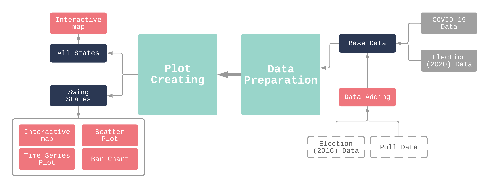

# Voting-COVID
[](https://travis-ci.org/lindseyulmer/Voting-COVID)<br /> [](https://coveralls.io/github/lindseyulmer/Voting-COVID?branch=main)
## Introduction
The purpose of this project is to use our module to visualize COVID and election data on the same plot, so that people can better discern the political ramifications of the pandemic.
- Background: The coronavirus pandemic has created unprecedented circumstances in the United States, affecting every aspect of American life including the election process. Rising cases and concern over the government’s response to the pandemic could have greatly influenced how and who Americans voted for. Data on coronavirus cases, election results, and the proportion of mail-in votes are all readily available, but coronavirus and election data are not readily available in the same place for comparison.
## Software dependencies and license information
#### Programming language: 
- Python
- HTML (not required but recommended)
#### Python packages needed:
- pandas
- NumPy
- geopandas
- bokeh
## Tutorial for using our module

#### Step 1: Download Data
Clone the github repo so that you have all necessary functions.
Prepare the data you will be adding as a csv.
#### Step 2: Add Data
Use the add_data function from `add_data.py` to add your desired data. It is recommended to use basedata.csv from the data directory as the starting directory so that you are adding your data onto to a csv that already contains the necessary geopandas information. The basedata.csv contains geopandas and cdc covid case data.
#### Step 3-1: Make Maps for all states
We can use functions in `make_plot_2020_and_2016.py` to build two maps to view the election results and covid data.
#### Step 3-2: Make Plots for the swing states

We can use functions in `make_plot_swings.py` to build a map to view the election results in the map. Also, we can make scatter plots to show two variables' relationships in the swing states. We also provide the making bar chart function to compared one variable for the key states in the 2016 and 2020 elections. We can view more details when we move our cursor to specific rectangles. Last, our time series function can help you show one attribute in the time series plot for states where each party won in the election.
#### Example of using our module
We have the example codes of using our module in `main.py`. You can find the results in the directory `example`.
## Function Summary
-add_data_csv(base_data, new_data, base_state_col, new_state_col,
use_state, how_join)
    -Does not process statefiles. Use this to add additional data at state level.
    
-add_data_shapefile(start_data, new_data_file, start_data_state, new_data_state,
states, new_file_name)
    -Does process statefiles. Use this to add additional locations and data.
    
-make_plot(df_covid_election, contiguous_usa)
    -Make state level maps for all states
    
-make_plot_map(source_df, shapefile, field, range_col, hover_list, title)
    -Make state level maps for swing states
    
-make_plot_scatter(source_df, category_list, color_col, color_palette,
x_col, y_col, hover_list, x_label, y_label, title, subtitle)
   -Make scatter plots for swing state data
   
-make_plot_bar(source_df, x_axis_list, title, y_1,
y_2, y1_label, y2_label, hover_list)
   -Make bar charts for swing state data
   
-make_plot_time_series(source_df, group_col, use_col,
y_label, title, hover_list)
   -Make time series plot the examples in main.py is for
   just swing states, but it could be used for all states
   as well
## Directory Structure
```bash  
├── CovidVoting
│   ├── __init__.py
│   ├── __pycache__
│   │   ├── __init__.cpython-37.pyc
│   │   ├── make_plot_swingstate.cpython-37.pyc
│   │   └── test_make_plot_swingstate.cpython-37.pyc
│   ├── add_data.py
│   ├── main.py
│   ├── make_plot_2020_and_2016.py
│   ├── make_plot_swingstate.py
│   └── test
│       ├── __init__.py
│       ├── __pycache__
│       │   ├── __init__.cpython-37.pyc
│       │   └── test_make_plot_swingstate.cpython-37.pyc
│       ├── test_add_data.py
│       ├── test_add_data_V2.py
│       ├── test_make_plot_2020_and_2016.py
│       └── test_make_plot_swingstate.py
├── LICENSE
├── README.md
├── __init__.py
├── data
│   ├── __init__.py
│   ├── basedata.csv
│   ├── coviddataand2020Election.csv
│   ├── data_formatting.ipynb
│   ├── keystates_covid_2020voting_poll.csv
│   ├── raw_0_states.csv
│   ├── raw_1_covid_daily.csv
│   ├── raw_2_covid_latest.csv
│   ├── raw_3_2020election.csv
│   ├── raw_5_2016election.csv
│   ├── raw_6_1_2016mail.csv
│   ├── raw_6_2016mail.csv
│   ├── raw_7_keystates_covid_voting_issue_poll.csv
│   ├── raw_8_2020_votebymail.csv
│   ├── shapefiles
│   │   ├── __init__.py
│   │   ├── cb_2018_us_nation_20m.cpg
│   │   ├── cb_2018_us_nation_20m.dbf
│   │   ├── cb_2018_us_nation_20m.prj
│   │   ├── cb_2018_us_nation_20m.shp
│   │   ├── cb_2018_us_nation_20m.shp.ea.iso.xml
│   │   ├── cb_2018_us_nation_20m.shp.iso.xml
│   │   ├── cb_2018_us_nation_20m.shx
│   │   ├── cb_2018_us_state_20m.cpg
│   │   ├── cb_2018_us_state_20m.dbf
│   │   ├── cb_2018_us_state_20m.prj
│   │   ├── cb_2018_us_state_20m.shp
│   │   ├── cb_2018_us_state_20m.shp.ea.iso.xml
│   │   ├── cb_2018_us_state_20m.shp.iso.xml
│   │   └── cb_2018_us_state_20m.shx
│   └── use_election.csv
├── docs
│   ├── Component_Specification.md
│   ├── Design.md
│   ├── Functional_Specification.md
│   ├── TechnologyReview.pdf
│   └── __init__.py
├── environment.yml
├── example
│   ├── demo_swingstate.gif
│   └── plot_swingstate.html
└── tree.txt
```
- CovidVoting: This directory holds the code for preparing data for visualization and making interactive plots to show Covid counts and voting results simultaneously. It also contains unit tests to prove the functionalities of each module.
- data: This directory contains data downloaded from multiple sources, including election results data from 2016 and 2020, Covid related data, and shapefile data that stores the geometric information of the United States.
- docs: This directory contains documentation including the functional specification, the design specification, the component specification and the final project presentation.
- example: This directory includes examples of using the functions in the CovidVoting directory.

